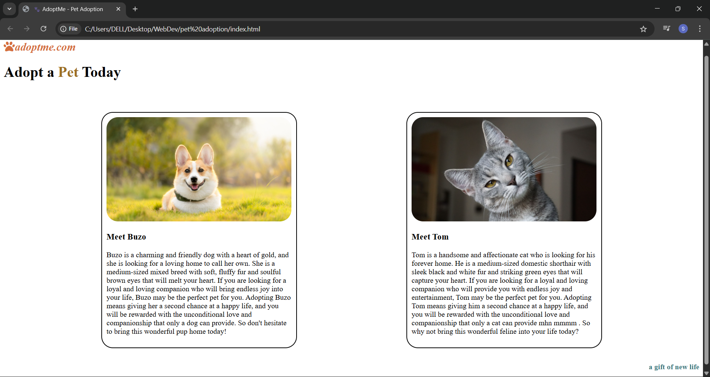

# 🐾 AdoptMe – Pet Adoption Website

A simple, responsive webpage that promotes pet adoption. Built using **HTML** and **CSS** (with media queries) as part of my web development learning journey.

## 🌟 Features

- 🐶 Showcases two adoptable pets (dog and cat)
- 📱 Responsive design (mobile, tablet, desktop)
- 🎨 Stylish card layout with modern fonts and colors
- 📷 Images with alt text for accessibility
- 💻 Clean, semantic HTML structure

## 💡 Technologies Used

- HTML5
- CSS3
- Media Queries (Responsive Design)

## 📸 Preview

## 📚 What I Learned

- How to structure and style a basic webpage using HTML and CSS
- Importance of **responsive design** using media queries
- Card layout and UI consistency
- Clean project structuring and writing readable code

## 📩 Feedback

If you have suggestions or feedback, feel free to reach out or open an issue.

---

👩‍💻 Built with 💙 by [Swati Thakur](https://github.com/codebyswatii)

